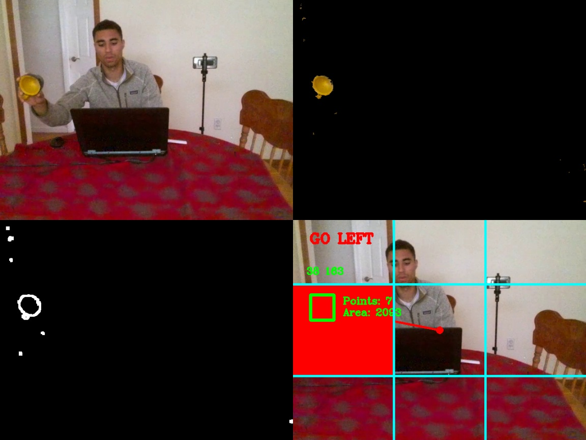
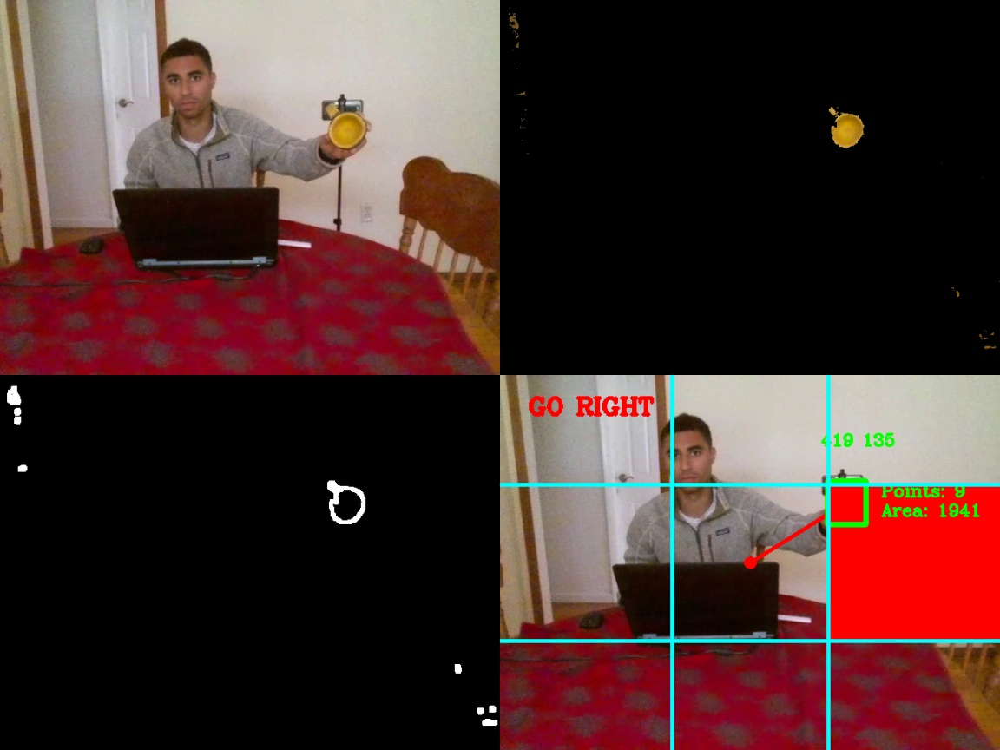
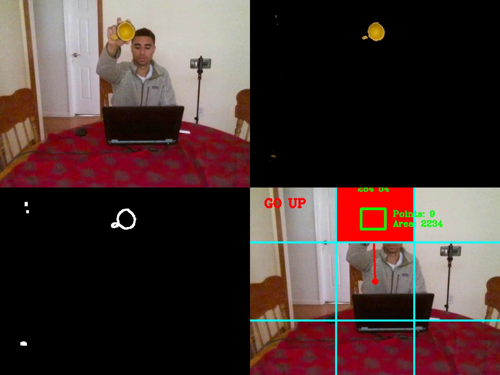
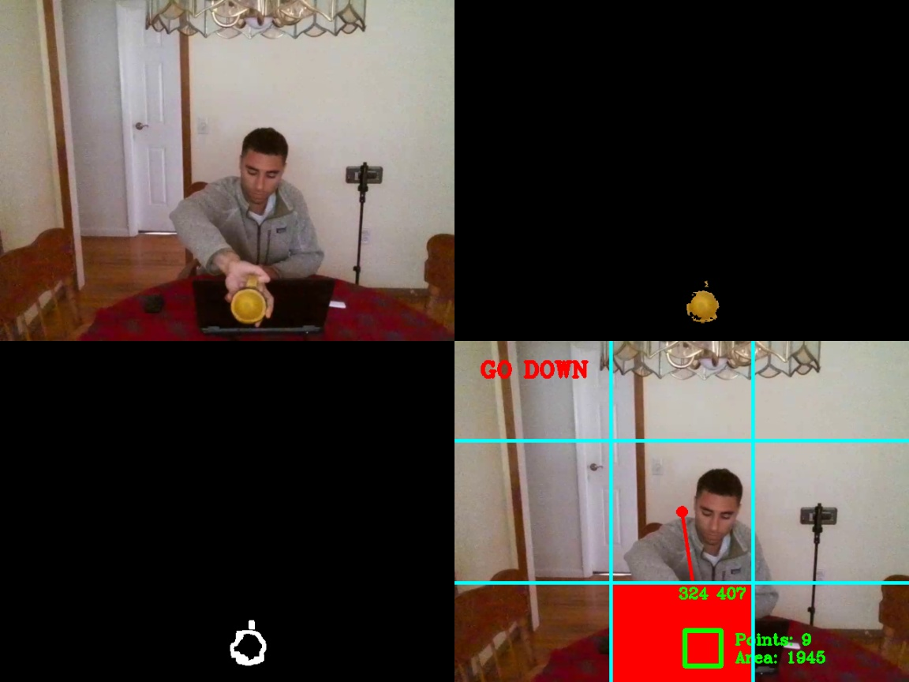

# Detection_and_Tracking

Allows drone to detect an object in a frame, track that object througout frames and follow the objects movements, with its own corresponding movements.

## Prerequisites

- Python3.5
- Python OpenCV
- Numpy 


## Run the program
- **Step1**. Turn on drone and connect computer to drone wifi.


- **Step2**. Open project folder in terminal. Run:
    
    ```
    python object_following.py
    ```

- **Step3**. A 2x2 display will be shown. The display consists of:

    - Live video stream from drone camera;
    - Object with in frame with surrounding background removed;
    - Canny edge results of object in frame;
    - Obejct within coordinate frame system to demonstrate which way the drone will move, based on object location;
    
    
## Results

&nbsp;&nbsp;&nbsp;&nbsp;&nbsp;  &nbsp;&nbsp;&nbsp;&nbsp;&nbsp;  

&nbsp;&nbsp;&nbsp;&nbsp;&nbsp;  &nbsp;&nbsp;&nbsp;&nbsp;&nbsp; 

<br />
<br />


[Drone POV Video](https://drive.google.com/file/d/1yWAgYMeQA_HYi2-YDEt4L-ab3gTCWHFK/view?usp=sharing)

<br />

[3rd person POV Video](3POV.mp4)
